# Informações do Projeto
`TÍTULO DO PROJETO`  

Dificuldade de acesso a tecnologia para idosos

`CURSO` 

Ciência da Computação

## Participantes

> - Arthur Patrocínio Neves
> - Marcelo Augusto Moreira
> - Gabriel Máximo de Castro
> - Igor Rodrigues de Abreu
> - Leandro Guido Lorenzini Santos
> - Pedro Corrêa Rigotto
# Estrutura do Documento

- [Informações do Projeto](#informações-do-projeto)
  - [Participantes](#participantes)
- [Estrutura do Documento](#estrutura-do-documento)
- [Introdução](#introdução)
  - [Problema](#problema)
  - [Objetivos](#objetivos)
  - [Justificativa](#justificativa)
  - [Público-Alvo](#público-alvo)
- [Especificações do Projeto](#especificações-do-projeto)
  - [Personas e Mapas de Empatia](#personas-e-mapas-de-empatia)
  - [Histórias de Usuários](#histórias-de-usuários)
  - [Requisitos](#requisitos)
    - [Requisitos Funcionais](#requisitos-funcionais)
    - [Requisitos não Funcionais](#requisitos-não-funcionais)
  - [Restrições](#restrições)
- [Projeto de Interface](#projeto-de-interface)
  - [User Flow](#user-flow)
  - [Wireframes](#wireframes)
- [Metodologia](#metodologia)
  - [Divisão de Papéis](#divisão-de-papéis)
  - [Ferramentas](#ferramentas)
  - [Controle de Versão](#controle-de-versão)
- [**############## SPRINT 1 ACABA AQUI #############**](#-sprint-1-acaba-aqui-)
- [Projeto da Solução](#projeto-da-solução)
  - [Tecnologias Utilizadas](#tecnologias-utilizadas)
  - [Arquitetura da solução](#arquitetura-da-solução)
- [Avaliação da Aplicação](#avaliação-da-aplicação)
  - [Plano de Testes](#plano-de-testes)
  - [Ferramentas de Testes (Opcional)](#ferramentas-de-testes-opcional)
  - [Registros de Testes](#registros-de-testes)
- [Referências](#referências)

# Introdução

## Problema

Muitos idosos hoje em dia apresentam dificuldades para usar as novas tecnologias e têm curiosidade em aprender mais sobre elas.
Usar aplicativo do banco, acessar novas formas de entretenimento como Netflix ou Spotify, usar melhor e mais as redes sociais, entre outros. Esses são alguns exemplos de funcionalidades que a tecnologia pode proporcionar que ajudaria a vida dos idosos.

## Objetivos

Nosso objetivo geral é ensinar os idosos a usar tecnologias modernas. 

### Objetivos específicos:
 - Ensinar os idosos a usar e configurar aparelhos celulares;
 - Ensinar os idosos a usar redes sociais e sites de entretenimento;
 - Ensinar os idosos a usar aplicativos de banco;
 - Responder perguntas dos idosos usando chatbot.

## Justificativa

De acordo com uma pesquisa feita pelo Sesc São Paulo e pela Fundação Perseu Abramo no começo de 2020, apenas 19% dos idosos fazem uso efetivo da internet, 28% já usaram um aplicativo e 38% já utilizaram redes sociais. No mundo de hoje a internet é essencial, e as entrevistas que nós fizemos mostraram que os idosos têm vontade de aprender a melhor usar a tecnologia. Por isso tivemos a ideia de montar um site que levaria ao idoso a informação que ele mais precisa para aprender a fazer esse uso, de maneira acessível e fácil de entender. 

## Público-Alvo

Embora todas as pessoas possam se beneficiar dos ensinamentos do site, o foco deste trabalho está no público idoso, que têm dificuldades em usar aparelhos celulares e sites que poderiam facilitar o seu dia a dia.

Desta forma, estabeleceu-se como público-alvo desta solução os idosos entre 65 e 80 anos que têm um conhecimento básico no uso de aparelhos eletrônicos e sentem necessidade ou curiosidade de aprender mais sobre a tecnologia mas não possuem meios para aprender a melhor utilizá-la. 

 
# Especificações do Projeto

Os problemas vividos pelos idosos e as soluções que encontramos foram definidos por meio de entrevistas e pesquisa de dados. Esses conhecimentos foram compilados na forma de personas e histórias de usuários. 

## Personas e Mapas de Empatia

Essas personas representam potenciais clientes que fazem parte de nosso público alvo. 

### Gertrudes

### Clotilde

### Paulo

## Histórias de Usuários

Com base na análise das personas forma identificadas as seguintes histórias de usuários:

|EU COMO... `PERSONA`| QUERO/PRECISO ... `FUNCIONALIDADE` |PARA ... `MOTIVO/VALOR`                 |
|--------------------|------------------------------------|----------------------------------------|
|Gertrudes| Auxílio em utilizar a tecnologia. | Ter mais comodidade no seu dia-a-dia.|
|Gertrudes| Diminuir dificuldades nas redes sociais. | Apesar de conseguir usar algumas redes sociais, ainda tem dificuldade com várias coisas, então gostaria de aprender mais. |
|Gertrudes| Explorar novas funções nas redes sociais.| Buscar novas formas de entretenimento,  além de conseguir se comunicar melhor com sua família.|
|Gertrudes| Diminuir a dependência da ajuda de outras pessoas.| Como não mora com parentes jovens, gostaria de ter sua independência no uso de tecnologia.|
|Clotilde | Auxílio para não cair em golpes na internet.          | Para não ter prejuízo.|
|Clotilde | Deseja saber como utilizar o aplicativo do banco.               | Para não ter que enfrentar fila na hora de pagar. |
|Clotilde | Assistir filmes, ouvir músicas.          | Acesso a mais formas de lazer, que são rápidas e sem precisar sair do conforto de casa. |
|Clotilde | Fazer compras pela internet (descobrir o site que terá o tipo de produto que ela deseja). | Facilitar a vida, não ter que sair de casa sempre para fazer compras, maior conforto. |
|Paulo    | Deseja descobrir novos meios de assistir shows e filmes e ouvir música.           | Ter acesso a formas de lazer, de maneira mais rápida e prática.|
|Paulo    | Quer aprender a usar aplicativos complexos como aplicativos de banco | Facilitar sua vida, não ter que sair de casa para resolver coisas que podem ser feitas no conforto de casa pelo celular. |
|Paulo    | Quer aprender a mudar configurações em seu celular  | Diminuir a dependência em outras pessoas para tarefas básicas.|

## Requisitos

As tabelas que se seguem apresentam os requisitos funcionais e não funcionais que detalham o escopo do projeto.

### Requisitos Funcionais

|ID    | Descrição do Requisito  | Prioridade |
|------|-----------------------------------------|----|
|RF-01| O site deve ter uma forma de feedback. | MÉDIA | 
|RF-02| O site deve permitir visualizar as informações de contatos do mantenedor do site. | MÉDIA  |
|RF-03| O site deve lembrar quais páginas o usuário já acessou. | MÉDIA |
|RF-04| O site deve ter um sistema de categorias.  | ALTA |
|RF-05| O site deve conter tutoriais de uso da tecnologia. | ALTA |
|RF-06| O site deve ter versão premium e gratuita. | ALTA |
|RF-07| O site deve ter tutoriais de uso de suas próprias funções. | ALTA |
|RF-08| Os tutoriais devem conter imagens, gifs e vídeos.  | ALTA |
|RF-09| O site deve ter um chatbot que responde a dúvidas e redireciona o usuário para as páginas relevantes a ele. | BAIXA |
|RF-10| O site deve permitir o compartilhamento de tutoriais. | BAIXA |
|RF-11| O site deve permitir ao usuário a compra de tutoriais avulsos.| MÉDIA |

### Requisitos não Funcionais

|ID     | Descrição do Requisito  |Prioridade |
|-------|-------------------------|----|
|RNF-01| O site deve ser limpo, não ter muitas informações na tela. | MÉDIA | 
|RNF-02| O site deve ser responsivo permitindo a visualização em um celular de forma adequada. |  ALTA | 
|RNF-03| O site deve ser facilmente legível. |  MÉDIA | 
|RNF-04| As informações devem ser claras, objetivas e completas. |  ALTA | 
|RNF-05| O site deve ser publicado em um ambiente acessível publicamente na Internet (Repl.it, GitHub Pages, Heroku). |  ALTA | 
|RNF-06| O site deve ser compatível com os principais navegadores do mercado (Google Chrome, Firefox, Microsoft Edge). |  ALTA | 
|RNF-07| O site deve ter bom nível de contraste entre os elementos da tela em conformidade. |  MÉDIA | 
|RNF-08| O sistema deve atender às normas legais de direitos autorais. |  MÉDIA | 

## Restrições

O projeto está restrito pelos itens apresentados na tabela a seguir.

|ID| Restrição                                             |
|--|-------------------------------------------------------|
|01| O projeto deverá ser entregue até o final do semestre letivo. |
|02| O aplicativo deve se restringir às tecnologias básicas da Web no Frontend. |
|03| A equipe não pode subcontratar o desenvolvimento do trabalho. |
|04| Não pode ser desenvolvido um módulo de backend. |

# Projeto de Interface

A interface desse site foi desenvolvida com o objetivo de maximizar a usabilidade e o entendimento das funções do site, tendo em mente que o nosso público alvo é composto por idosos que têm dificuldade em utilizar sites. Todas as escolhas foram feitas com o intuito de deixar o site mais limpo e fácil de usar para alguém que não conheça as funções normais de um site, como a escolha de incluir um chatbot para responder dúvidas e a existência de links para páginas que explicam o uso básico do site em todas as páginas mais complexas.

## User Flow

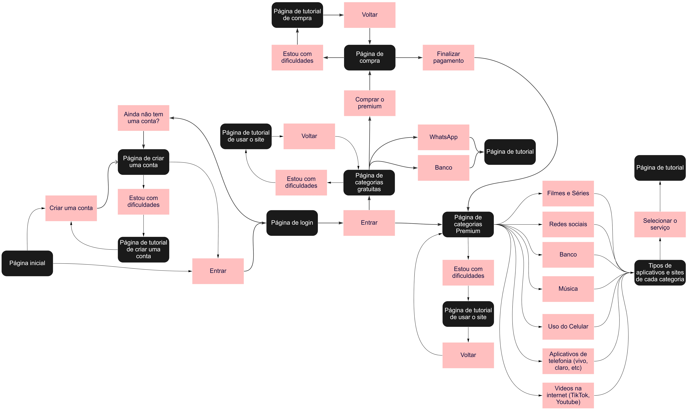

## Wireframes

Estes wireframes são protótipos representativos do layout das páginas do nosso site. Abaixo estão dispostos os wireframes das páginas em suas versões mobile e desktop.

### Computador:

#### Página Inicial
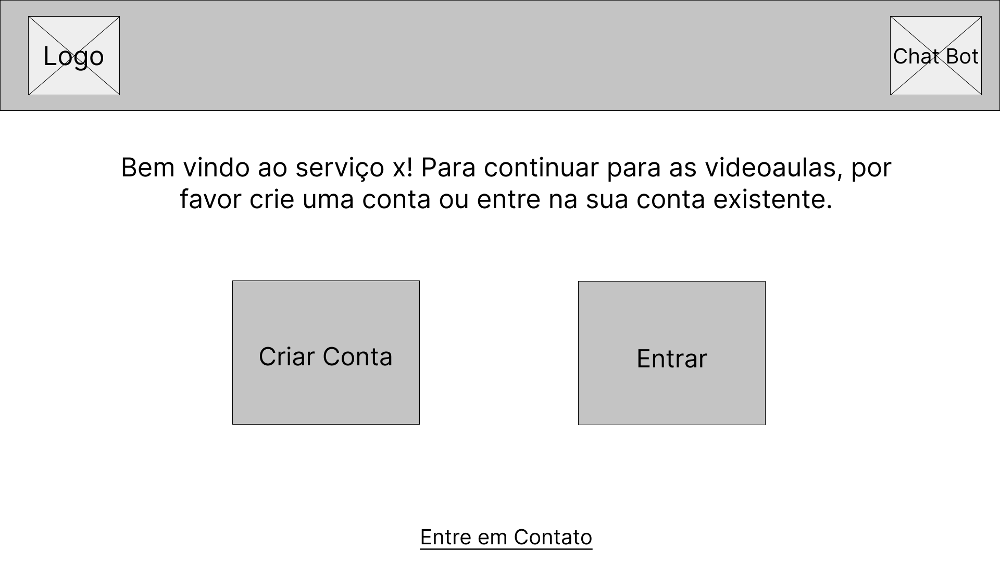

#### Página De Registro
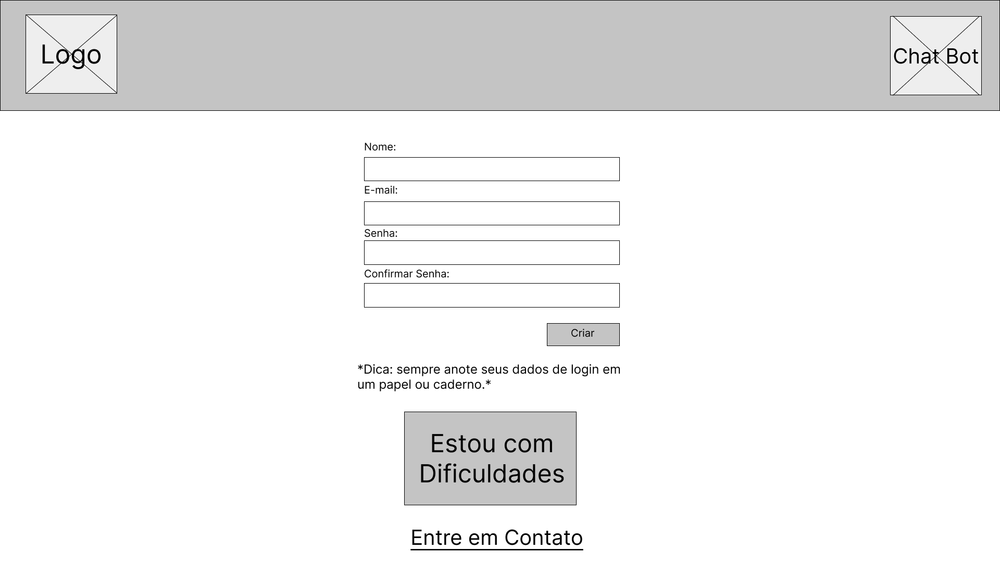

#### Página De Login
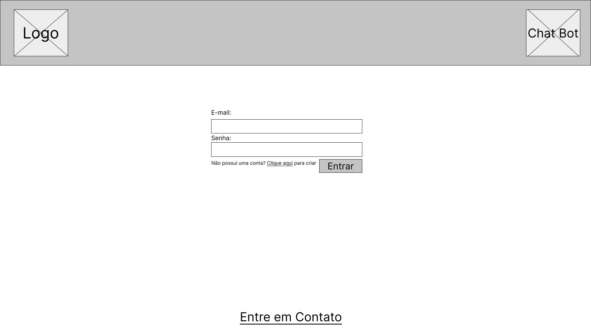

#### Página Tutorial
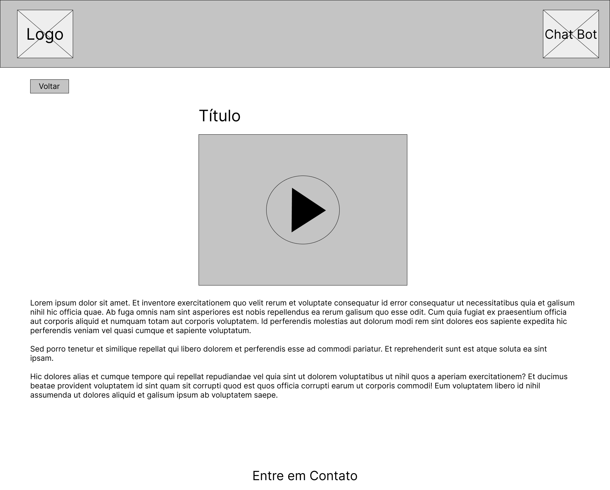

#### Página de categorias gratuitas
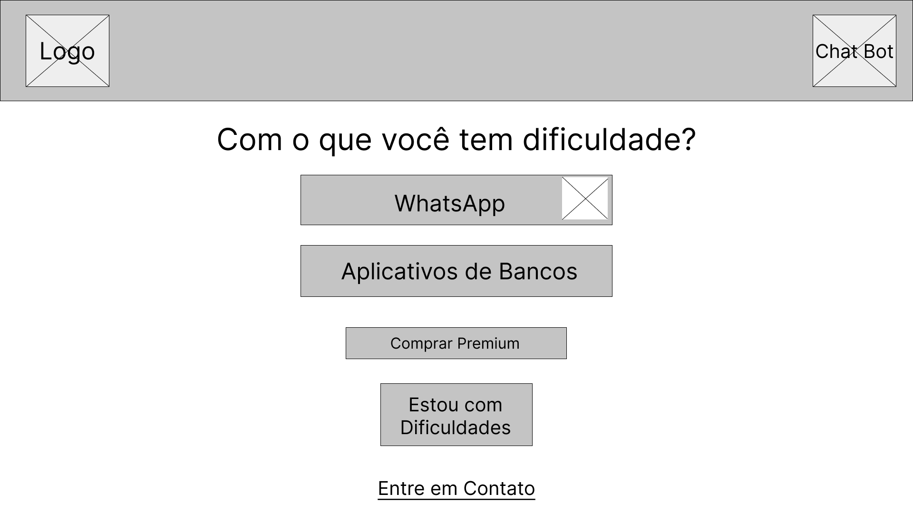

#### Página de categorias premium
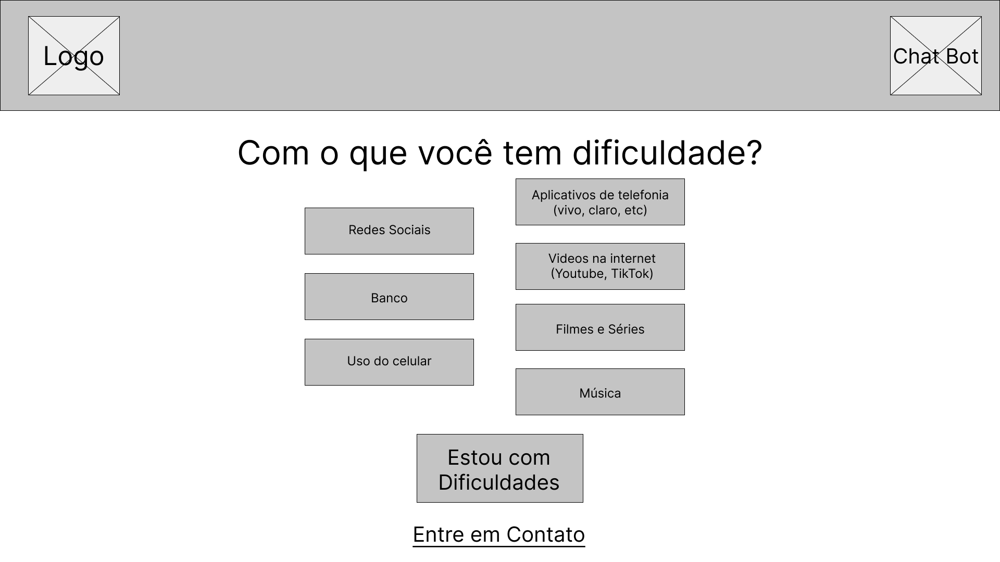

#### Página De Compras
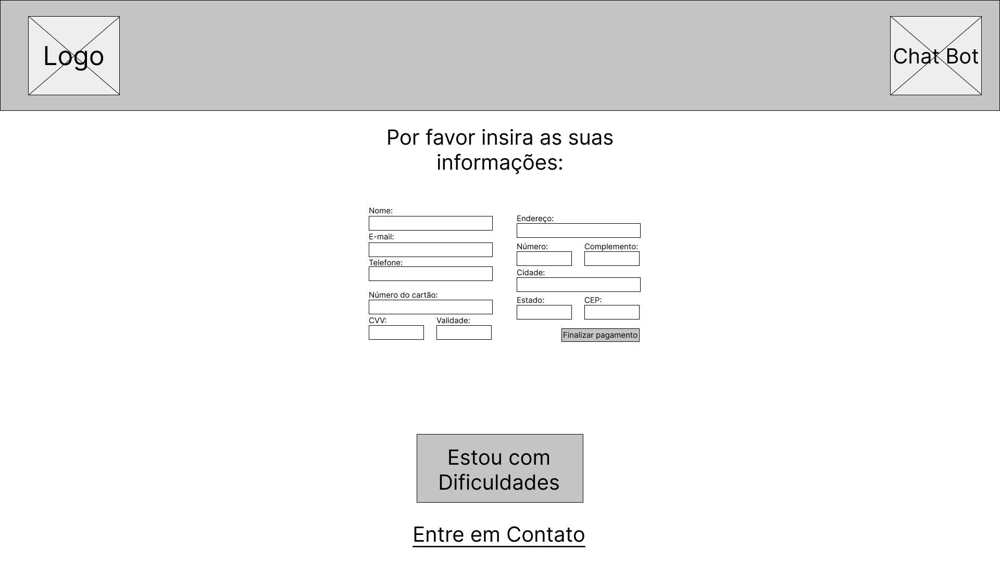

#### Tipos Para Cada Categoria
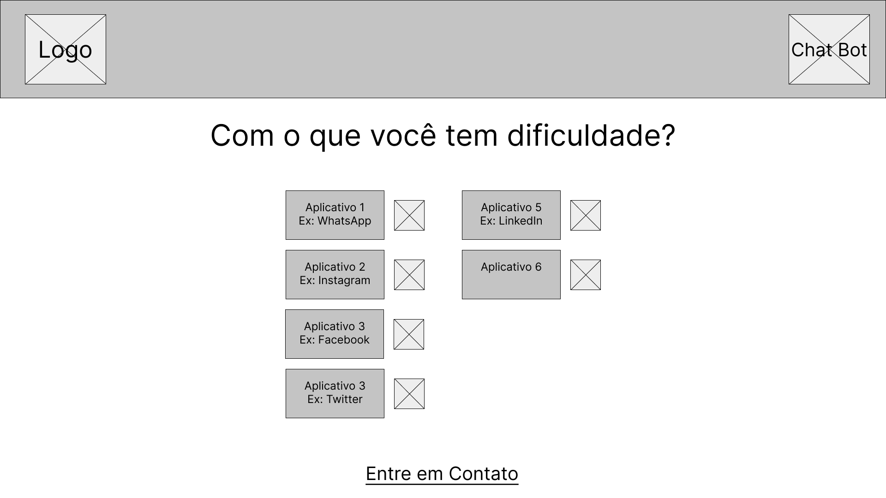

#### Página De Contato
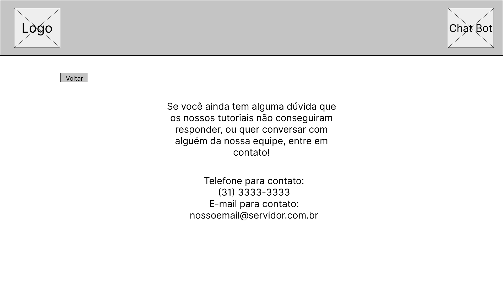

#### Chat Bot
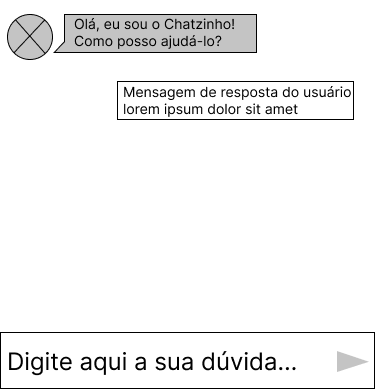

### Celular:

#### Página Inicial
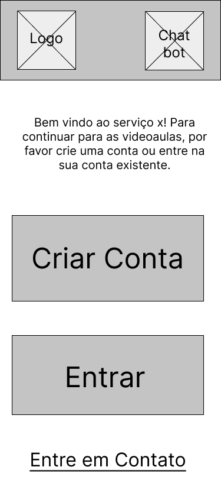

#### Página De Registro
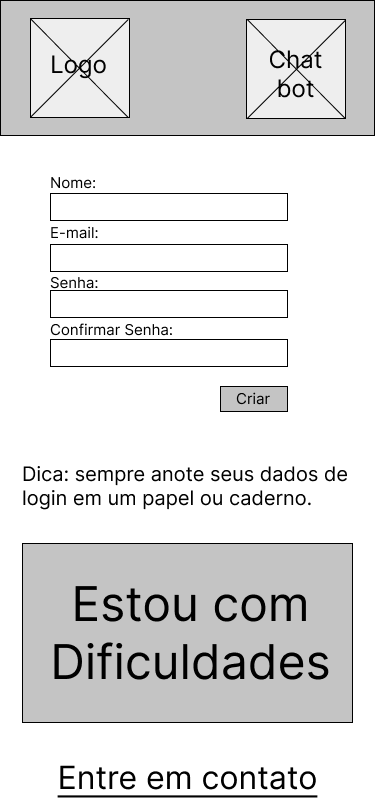

#### Página De Login
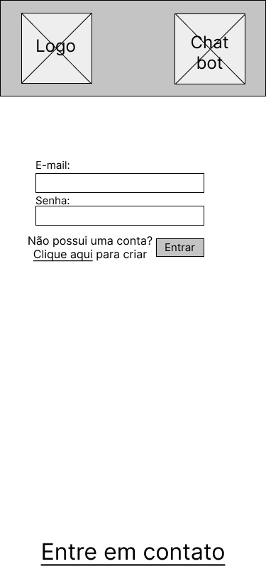

#### Página Tutorial
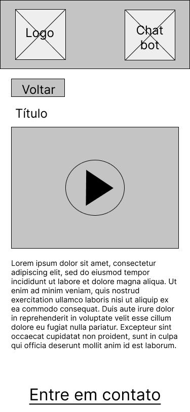

#### Página de categorias gratuitas
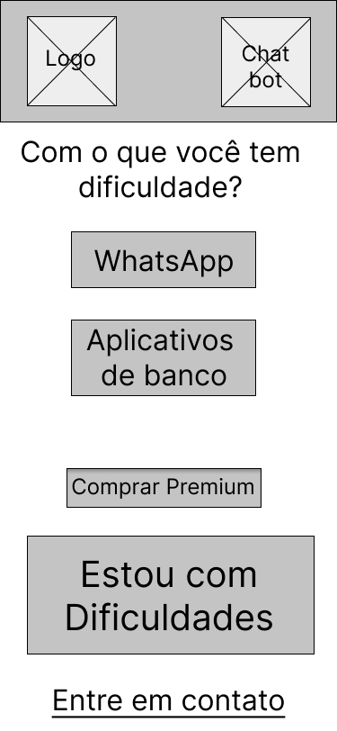

#### Página de categorias premium
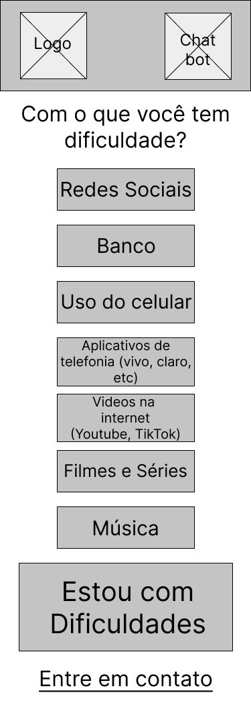

#### Página De Compras
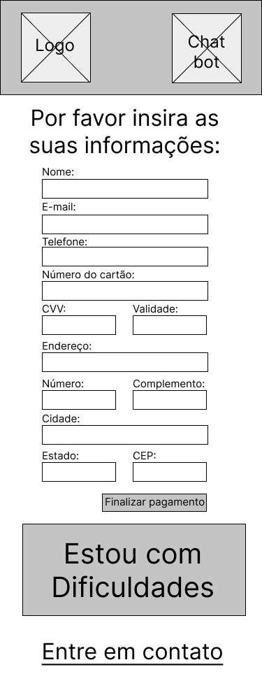

#### Tipos Para Cada Categoria
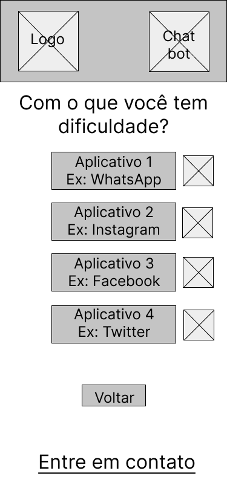

#### Página De Contato
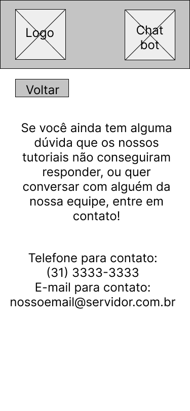

#### Chat Bot

### Prototipo interativo
https://www.figma.com/proto/WxroO44dUZI2bpzhkzRxTy/Wireframe-TIAW?node-id=456%3A37&scaling=scale-down&page-id=411%3A2&starting-point-node-id=456%3A37&show-proto-sidebar=1

# Metodologia

......  COLOQUE AQUI O SEU TEXTO ......

Ferramentas usadas: Trello, Miro, Figma

> Nesta parte do documento, você deve apresentar a metodologia 
> adotada pelo grupo, descrevendo o processo de trabalho baseado nas metodologias ágeis, 
> a divisão de papéis e tarefas, as ferramentas empregadas e como foi realizada a
> gestão de configuração do projeto via GitHub.
>
> Coloque detalhes sobre o processo de Design Thinking e a implementação do Framework Scrum seguido
> pelo grupo. O grupo poderá fazer uso de ferramentas on-line para acompanhar
> o andamento do projeto, a execução das tarefas e o status de desenvolvimento
> da solução.
> 
> **Links Úteis**:
> - [Tutorial Trello](https://trello.com/b/8AygzjUA/tutorial-trello)
> - [Gestão ágil de projetos com o Trello](https://www.youtube.com/watch?v=1o9BOMAKBRE)
> - [Gerência de projetos - Trello com Scrum](https://www.youtube.com/watch?v=DHLA8X_ujwo)
> - [Tutorial Slack](https://slack.com/intl/en-br/)
## Divisão de Papéis

......  COLOQUE AQUI O SEU TEXTO ......
- O grupo dividiu entre 3 categorias seguindo o a metodologia Scrum:
- Scrum Master: Pedro Corrêa Rigotto
- Project Owner: Leandro Guido Lorenzini Santos
- Developers: Arthur Patrocínio Neves, Marcelo Augusto Moreira, Gabriel Máximo de Castro, Igor Rodrigues de Abreu

> Apresente a divisão de papéis e tarefas entre os membros do grupo.
>
> **Links Úteis**:
> - [11 Passos Essenciais para Implantar Scrum no seu Projeto](https://mindmaster.com.br/scrum-11-passos/)
> - [Scrum em 9 minutos](https://www.youtube.com/watch?v=XfvQWnRgxG0)

## Ferramentas

......  COLOQUE AQUI O SEU TEXTO - SIGA O EXEMPLO DA TABELA ABAIXO  ......

| Ambiente  | Plataforma              |Link de Acesso |
|-----------|-------------------------|---------------|
|Processo de Design Thinkgin  | Miro |  https://miro.com/XXXXXXX | 
|Repositório de código | GitHub | https://github.com/XXXXXXX | 
|Hospedagem do site | Heroku |  https://XXXXXXX.herokuapp.com | 
|Protótipo Interativo | MavelApp ou Figma | https://figma.com/XXXXXXX | 

>
> Liste as ferramentas empregadas no desenvolvimento do
> projeto, justificando a escolha delas, sempre que possível.
> 
> As ferramentas empregadas no projeto são:
> 
> - Editor de código.
> - Ferramentas de comunicação
> - Ferramentas de diagramação
> - Plataforma de hospedagem
> 
> O editor de código foi escolhido porque ele possui uma integração com o
> sistema de versão. As ferramentas de comunicação utilizadas possuem
> integração semelhante e por isso foram selecionadas. Por fim, para criar
> diagramas utilizamos essa ferramenta por melhor captar as
> necessidades da nossa solução.
> 
> **Links Úteis - Hospedagem**:
> - [Getting Started with Heroku](https://devcenter.heroku.com/start)
> - [Crie seu Site com o HostGator](https://www.hostgator.com.br/como-publicar-seu-site)
> - [GoDady](https://br.godaddy.com/how-to)
> - [GitHub Pages](https://pages.github.com/)
## Controle de Versão

......  COLOQUE AQUI O SEU TEXTO ......

> Discuta como a configuração do projeto foi feita na ferramenta de
> versionamento escolhida. Exponha como a gerência de tags, merges,
> commits e branchs é realizada. Discuta como a gerência de issues foi
> realizada.
> A ferramenta de controle de versão adotada no projeto foi o
> [Git](https://git-scm.com/), sendo que o [Github](https://github.com)
> foi utilizado para hospedagem do repositório `upstream`.
> 
> O projeto segue a seguinte convenção para o nome de branchs:
> 
> - `master`: versão estável já testada do software
> - `unstable`: versão já testada do software, porém instável
> - `testing`: versão em testes do software
> - `dev`: versão de desenvolvimento do software
> 
> Quanto à gerência de issues, o projeto adota a seguinte convenção para
> etiquetas:
> 
> - `bugfix`: uma funcionalidade encontra-se com problemas
> - `enhancement`: uma funcionalidade precisa ser melhorada
> - `feature`: uma nova funcionalidade precisa ser introduzida
>
> **Links Úteis**:
> - [Tutorial GitHub](https://guides.github.com/activities/hello-world/)
> - [Git e Github](https://www.youtube.com/playlist?list=PLHz_AreHm4dm7ZULPAmadvNhH6vk9oNZA)
> - [5 Git Workflows & Branching Strategy to deliver better code](https://zepel.io/blog/5-git-workflows-to-improve-development/)
>
> **Exemplo - GitHub Feature Branch Workflow**:
>
> 

# **############## SPRINT 1 ACABA AQUI #############**

# Projeto da Solução

......  COLOQUE AQUI O SEU TEXTO ......

## Tecnologias Utilizadas

......  COLOQUE AQUI O SEU TEXTO ......

> Descreva aqui qual(is) tecnologias você vai usar para resolver o seu
> problema, ou seja, implementar a sua solução. Liste todas as
> tecnologias envolvidas, linguagens a serem utilizadas, serviços web,
> frameworks, bibliotecas, IDEs de desenvolvimento, e ferramentas.
> Apresente também uma figura explicando como as tecnologias estão
> relacionadas ou como uma interação do usuário com o sistema vai ser
> conduzida, por onde ela passa até retornar uma resposta ao usuário.
> 
> Inclua os diagramas de User Flow, esboços criados pelo grupo
> (stoyboards), além dos protótipos de telas (wireframes). Descreva cada
> item textualmente comentando e complementando o que está apresentado
> nas imagens.
## Arquitetura da solução

......  COLOQUE AQUI O SEU TEXTO E O DIAGRAMA DE ARQUITETURA .......

> Inclua um diagrama da solução e descreva os módulos e as tecnologias
> que fazem parte da solução. Discorra sobre o diagrama.
> 
> **Exemplo do diagrama de Arquitetura**:
> 
> 

# Avaliação da Aplicação

......  COLOQUE AQUI O SEU TEXTO ......

> Apresente os cenários de testes utilizados na realização dos testes da
> sua aplicação. Escolha cenários de testes que demonstrem os requisitos
> sendo satisfeitos.
## Plano de Testes

......  COLOQUE AQUI O SEU TEXTO ......

> Enumere quais cenários de testes foram selecionados para teste. Neste
> tópico o grupo deve detalhar quais funcionalidades avaliadas, o grupo
> de usuários que foi escolhido para participar do teste e as
> ferramentas utilizadas.
> 
> **Links Úteis**:
> - [IBM - Criação e Geração de Planos de Teste](https://www.ibm.com/developerworks/br/local/rational/criacao_geracao_planos_testes_software/index.html)
> - [Práticas e Técnicas de Testes Ágeis](http://assiste.serpro.gov.br/serproagil/Apresenta/slides.pdf)
> -  [Teste de Software: Conceitos e tipos de testes](https://blog.onedaytesting.com.br/teste-de-software/)
## Ferramentas de Testes (Opcional)

......  COLOQUE AQUI O SEU TEXTO ......

> Comente sobre as ferramentas de testes utilizadas.
> 
> **Links Úteis**:
> - [Ferramentas de Test para Java Script](https://geekflare.com/javascript-unit-testing/)
> - [UX Tools](https://uxdesign.cc/ux-user-research-and-user-testing-tools-2d339d379dc7)
## Registros de Testes

......  COLOQUE AQUI O SEU TEXTO ......

> Discorra sobre os resultados do teste. Ressaltando pontos fortes e
> fracos identificados na solução. Comente como o grupo pretende atacar
> esses pontos nas próximas iterações. Apresente as falhas detectadas e
> as melhorias geradas a partir dos resultados obtidos nos testes.

# Referências

......  COLOQUE AQUI O SEU TEXTO ......

> Inclua todas as referências (livros, artigos, sites, etc) utilizados
> no desenvolvimento do trabalho.
> 
> **Links Úteis**:
> - [Formato ABNT](https://www.normastecnicas.com/abnt/trabalhos-academicos/referencias/)
> - [Referências Bibliográficas da ABNT](https://comunidade.rockcontent.com/referencia-bibliografica-abnt/)
