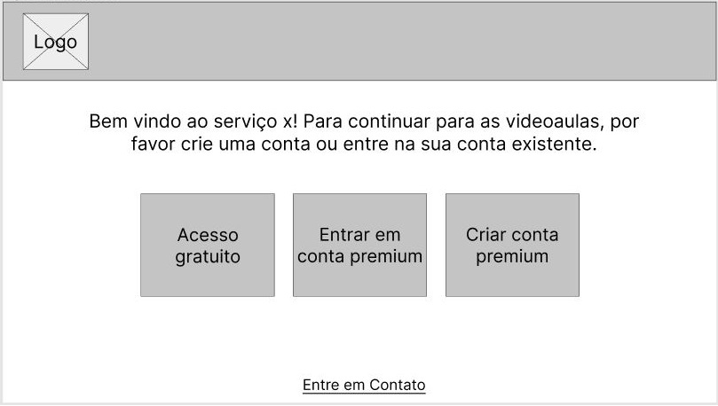

# Informações do Projeto
`TÍTULO DO PROJETO`  

Dificuldade de acesso a tecnologia para idosos

`CURSO` 

Ciência da Computação

## Participantes

- Arthur Patrocínio Neves
- Marcelo Augusto Moreira
- Gabriel Máximo de Castro
- Leandro Guido Lorenzini Santos
- Pedro Corrêa Rigotto
# Estrutura do Documento

- [Informações do Projeto](#informações-do-projeto)
  - [Participantes](#participantes)
- [Estrutura do Documento](#estrutura-do-documento)
- [Introdução](#introdução)
  - [Problema](#problema)
  - [Objetivos](#objetivos)
  - [Justificativa](#justificativa)
  - [Público-Alvo](#público-alvo)
- [Especificações do Projeto](#especificações-do-projeto)
  - [Personas e Mapas de Empatia](#personas-e-mapas-de-empatia)
  - [Histórias de Usuários](#histórias-de-usuários)
  - [Requisitos](#requisitos)
    - [Requisitos Funcionais](#requisitos-funcionais)
    - [Requisitos não Funcionais](#requisitos-não-funcionais)
  - [Restrições](#restrições)
- [Projeto de Interface](#projeto-de-interface)
  - [User Flow](#user-flow)
  - [Wireframes](#wireframes)
- [Metodologia](#metodologia)
  - [Divisão de Papéis](#divisão-de-papéis)
  - [Ferramentas](#ferramentas)
  - [Controle de Versão](#controle-de-versão)
- [Projeto da Solução](#projeto-da-solução)
  - [Tecnologias Utilizadas](#tecnologias-utilizadas)
  - [Arquitetura da solução](#arquitetura-da-solução)
- [Avaliação da Aplicação](#avaliação-da-aplicação)
  - [Plano de Testes](#plano-de-testes)
  - [Ferramentas de Testes (Opcional)](#ferramentas-de-testes-opcional)
  - [Registros de Testes](#registros-de-testes)
- [Referências](#referências)

# Introdução

## Problema

Muitos idosos hoje em dia apresentam dificuldades para usar as novas tecnologias e têm curiosidade em aprender mais sobre elas.
Usar aplicativo do banco, acessar novas formas de entretenimento como Netflix ou Spotify, usar melhor e mais as redes sociais, entre outros. Esses são alguns exemplos de funcionalidades que a tecnologia pode proporcionar que ajudaria a vida dos idosos.

## Objetivos

Nosso objetivo geral é ensinar os idosos a usar tecnologias modernas. 

### Objetivos específicos:
 - Ensinar os idosos a usar e configurar aparelhos celulares;
 - Ensinar os idosos a usar redes sociais e sites de entretenimento;
 - Ensinar os idosos a usar aplicativos de banco;
 - Responder perguntas dos idosos usando chatbot.

## Justificativa

De acordo com uma pesquisa feita pelo Sesc São Paulo e pela Fundação Perseu Abramo no começo de 2020, apenas 19% dos idosos fazem uso efetivo da internet, 28% já usaram um aplicativo e 38% já utilizaram redes sociais. No mundo de hoje a internet é essencial, e as entrevistas que nós fizemos mostraram que os idosos têm vontade de aprender a melhor usar a tecnologia. Por isso tivemos a ideia de montar um site que levaria ao idoso a informação que ele mais precisa para aprender a fazer esse uso, de maneira acessível e fácil de entender. 

## Público-Alvo

Embora todas as pessoas possam se beneficiar dos ensinamentos do site, o foco deste trabalho está no público idoso, que têm dificuldades em usar aparelhos celulares e sites que poderiam facilitar o seu dia a dia.

Desta forma, estabeleceu-se como público-alvo desta solução os idosos entre 65 e 80 anos que têm um conhecimento básico no uso de aparelhos eletrônicos e sentem necessidade ou curiosidade de aprender mais sobre a tecnologia mas não possuem meios para aprender a melhor utilizá-la. 

 
# Especificações do Projeto

Os problemas vividos pelos idosos e as soluções que encontramos foram definidos por meio de entrevistas e pesquisa de dados. Esses conhecimentos foram compilados na forma de personas e histórias de usuários.

## Personas e Mapas de Empatia

Essas personas representam potenciais clientes que fazem parte de nosso público alvo. 

### Gertrudes

### Clotilde

### Paulo

## Histórias de Usuários

Com base na análise das personas forma identificadas as seguintes histórias de usuários:

|EU COMO... `PERSONA`| QUERO/PRECISO ... `FUNCIONALIDADE` |PARA ... `MOTIVO/VALOR`                 |
|--------------------|------------------------------------|----------------------------------------|
|Gertrudes| Auxílio em utilizar a tecnologia. | Ter mais comodidade no seu dia-a-dia.|
|Gertrudes| Diminuir dificuldades nas redes sociais. | Apesar de conseguir usar algumas redes sociais, ainda tem dificuldade com várias coisas, então gostaria de aprender mais. |
|Gertrudes| Explorar novas funções nas redes sociais.| Buscar novas formas de entretenimento,  além de conseguir se comunicar melhor com sua família.|
|Gertrudes| Diminuir a dependência da ajuda de outras pessoas.| Como não mora com parentes jovens, gostaria de ter sua independência no uso de tecnologia.|
|Clotilde | Auxílio para não cair em golpes na internet.          | Para não ter prejuízo.|
|Clotilde | Deseja saber como utilizar o aplicativo do banco.               | Para não ter que enfrentar fila na hora de pagar. |
|Clotilde | Assistir filmes, ouvir músicas.          | Acesso a mais formas de lazer, que são rápidas e sem precisar sair do conforto de casa. |
|Clotilde | Fazer compras pela internet (descobrir o site que terá o tipo de produto que ela deseja). | Facilitar a vida, não ter que sair de casa sempre para fazer compras, maior conforto. |
|Paulo    | Deseja descobrir novos meios de assistir shows e filmes e ouvir música.           | Ter acesso a formas de lazer, de maneira mais rápida e prática.|
|Paulo    | Quer aprender a usar aplicativos complexos como aplicativos de banco | Facilitar sua vida, não ter que sair de casa para resolver coisas que podem ser feitas no conforto de casa pelo celular. |
|Paulo    | Quer aprender a mudar configurações em seu celular  | Diminuir a dependência em outras pessoas para tarefas básicas.|

## Requisitos

As tabelas que se seguem apresentam os requisitos funcionais e não funcionais que detalham o escopo do projeto.

### Requisitos Funcionais

|ID    | Descrição do Requisito  | Prioridade |
|------|-----------------------------------------|----|
|RF-01| O site deve ter uma forma de feedback. | MÉDIA | 
|RF-02| O site deve permitir visualizar as informações de contatos do mantenedor do site. | MÉDIA  |
|RF-03| O site deve permitir o compartilhamento de tutoriais. | BAIXA |
|RF-04| O site deve ter um sistema de categorias.  | ALTA |
|RF-05| O site deve conter tutoriais de uso da tecnologia. | ALTA |
|RF-06| O site deve ter versão premium e gratuita. | ALTA |
|RF-07| O site deve ter tutoriais de uso de suas próprias funções. | ALTA |
|RF-08| Os tutoriais devem conter vídeos.  | ALTA |
|RF-09| O site deve permitir ao usuário a compra de tutoriais avulsos.| MÉDIA |

### Requisitos não Funcionais

|ID     | Descrição do Requisito  |Prioridade |
|-------|-------------------------|----|
|RNF-01| O site deve ser limpo, não ter muitas informações na tela. | MÉDIA | 
|RNF-02| O site deve ser responsivo permitindo a visualização em um celular de forma adequada. |  ALTA | 
|RNF-03| O site deve ser facilmente legível. |  MÉDIA | 
|RNF-04| As informações devem ser claras, objetivas e completas. |  ALTA | 
|RNF-05| O site deve ser publicado em um ambiente acessível publicamente na Internet (Repl.it, GitHub Pages, Heroku). |  ALTA | 
|RNF-06| O site deve ser compatível com os principais navegadores do mercado (Google Chrome, Firefox, Microsoft Edge). |  ALTA | 
|RNF-07| O site deve ter bom nível de contraste entre os elementos da tela em conformidade. |  MÉDIA | 
|RNF-08| O sistema deve atender às normas legais de direitos autorais. |  MÉDIA | 

## Restrições

O projeto está restrito pelos itens apresentados na tabela a seguir.

|ID| Restrição                                             |
|--|-------------------------------------------------------|
|01| O projeto deverá ser entregue até o final do semestre letivo. |
|02| O aplicativo deve se restringir às tecnologias básicas da Web no Frontend. |
|03| A equipe não pode subcontratar o desenvolvimento do trabalho. |
|04| Não pode ser desenvolvido um módulo de backend. |

# Projeto de Interface

A interface desse site foi desenvolvida com o objetivo de maximizar a usabilidade e o entendimento das funções do site, tendo em mente que o nosso público alvo é composto por idosos que têm dificuldade em utilizar sites. Todas as escolhas foram feitas com o intuito de deixar o site mais limpo e fácil de usar para alguém que não conheça as funções normais de um site, como a escolha de incluir um chatbot para responder dúvidas e a existência de links para páginas que explicam o uso básico do site em todas as páginas mais complexas.

## User Flow

## Wireframes

Estes wireframes são protótipos representativos do layout das páginas do nosso site. Abaixo estão dispostos os wireframes das páginas em suas versões mobile e desktop.

### Computador:

#### Página Inicial

> Tela que abrange todas as visualizações iniciais do site.

#### Página de Compra e Registro

> Página que permite a criação de novos usuários premium.

#### Página de Login

> Página que valida o usuário, para utilizar os recursos da conta premium. 

#### Página de Tutorial

> A página de tutorial mostra um vídeo e um texto de um tutorial presente no banco de dados.

#### Página de Tutoriais Gratuitos

> A página mostra os tutoriais que podem ser acessados sem uma conta (acesso gratuito).

#### Página com Categorias Premium

> A página mostra as categorias dos tutoriais que podem ser acessados com uma conta premium.

#### Página de Tutoriais Premium

> Página que exibe botões de tipos para cada categoria dos tutoriais.

#### Página de Contato

> Tela que mostra o telefone e e-mail para contato.

#### Página de Login de Administradores

> Página que valida o usuário de administrador, para utilizar recursos de administrador. 

#### Página inicial de Administração

> Página que exibe todos os usuários administradores e permite a sua criação, edição e remoção.

#### Página de Cadastro de Tutorial

> Página que exibe todos os tutoriais e permite a criação, edição e remoção.

#### Página de Gerenciamento de Usuários

> Página que permite a edição e remoção de usuários premium.

#### Página de Manutenção de Categorias

> A página permite a alteração, adição e remoção de categorias.

### Celular:

#### Página Inicial

#### Página de Compra e Registro

#### Página de Login

#### Página de Tutorial

#### Página de Tutoriais Gratuitos

#### Página com Categorias Premium

#### Página de Tutoriais Premium

#### Página de Contato

### Prototipo interativo
https://www.figma.com/proto/WxroO44dUZI2bpzhkzRxTy/Wireframe-TIAW?node-id=456%3A37&scaling=min-zoom&page-id=411%3A2&starting-point-node-id=456%3A37&show-proto-sidebar=1

# Metodologia

A metodologia usada foi baseada nos processos de Design Thinking e Scrum. Nos dividimos entre scrum master, product owner, e desenvolvedores. Compilamos nossos conhecimentos em matriz CSD e mapa de stakeholders, fizemos entrevistas para definir o problema que queremos resolver, compilamos o conhecimento adquirido com as entrevistas em personas do nosso público alvo, e exploramos as possíveis soluções em processo de design thinking composto por brainstorming e detalhamento das ideias. Após decidirmos quais ideias seriam o nosso foco, começamos a projetar o site com user flow e wireframes, e documentamos todo esse processo.

## Divisão de Papéis

### O grupo dividiu entre 3 categorias seguindo a metodologia Scrum:
- Scrum Master: Pedro Corrêa Rigotto
- Project Owner: Leandro Guido Lorenzini Santos
- Developers: Arthur Patrocínio Neves, Marcelo Augusto Moreira, Gabriel Máximo de Castro

## Ferramentas

| Ambiente  | Plataforma              |Link de Acesso |
|-----------|-------------------------|---------------|
|Processo de Design Thinking  | Miro |  https://miro.com/app/board/uXjVOB6EAyE=/ | 
|Repositório de código | GitHub | https://github.com/ICEI-PUC-Minas-PMGCC-TI/tiaw-pmg-cc-m-20221-dificuldade-tecnologia-para-idosos-2/tree/master/codigo/Site%20idosos%20-%20TIAW | 
|UserFlow  | Miro |  https://miro.com/app/board/uXjVOD0ok5U=/ | 
|Protótipo Interativo| Figma | https://www.figma.com/proto/WxroO44dUZI2bpzhkzRxTy/Wireframe-TIAW?node-id=456%3A37&scaling=min-zoom&page-id=411%3A2&starting-point-node-id=456%3A37&show-proto-sidebar=1 | 
|Pasta de arquivos | Google Drive | https://drive.google.com/drive/u/0/folders/1marKWIjC55KoiCpo3A-xOJ6KfAd2coiH | 
|Kanban | Trello | https://trello.com/invite/b/5cD4kkFF/b54b487cea6ad140b22307a1eb07bfd3/kanban-tiaw-idosos | 

# Projeto da Solução

O site foi planejado e criado para apresentar uma funcionalidade simples para os idosos conseguirem usar facilmente. A navegação é feita por botões bem visíveis e evidentes, e as páginas contam com um botão de ajuda que contém um tutorial de uso do proprio site, dessa forma, os idosos, em grande parte leigos em tecnologia, terão poucas dificuldades ao utilizar o nosso site.

## Tecnologias Utilizadas

As tecnologias que foram utilizadas para o desenvolvimento do projeto foram as linguagens HTML, CSS e JavaScript, o framework Bootstrap, IDE Visual Studio Code, Google Drive para gerenciamento de documentos, Replit para hospedagem, Figma para criação de [wireframes](#wireframes), Miro para documentação do processo de design thinking e criação do [user flow](#user-flow), Trello para kanban, Discord para comunicação, e Google Documents para edição compartilhada de documentos.

## Arquitetura da solução

 Os componentes que fazem parte da solução são apresentados na Figura que se segue.

**Diagrama de Componentes**:
 

A solução implementada conta com os seguintes módulos:

- Navegador - Interface básica do sistema 
- Páginas Web - Conjunto de arquivos HTML, CSS, JavaScript e imagens que implementam as funcionalidades do sistema.
- Local Storage - armazenamento mantido no Navegador, onde são implementados bancos de dados baseados em JSON. São eles: 
  - db_categoria - banco de dados com as categorias dos tutoriais
  - db_tutorial - banco de dados com os tutoriais
  - db_admin - banco de dados com as contas administradores
  - db_usu - banco de dados com as contas de usuarios
- Session Storage - armazenamento mantido no Navegador até expirar a sessão da página, onde são implementados bancos de dados b aseados em JSON. São eles: 
  - usuarioCorrente - conta que está logada no momento

### Hospedagem - local na Internet onde as páginas são mantidas e acessadas pelo navegador. 
O site utiliza a plataforma Replit como ambiente de hospedagem do site do projeto. O site é mantido no ambiente da URL: 
https://tiaw-dificuldade-de-acesso-a-tecnologia-por-idosos.pedrocorrea10.repl.co/

# Avaliação da Aplicação

O processo de realização dos testes da solução desenvolvida está documentado na seção que se segue e traz os planos de testes de software e de usabilidade, na sequência, o registro dos testes realizados.

## Plano de Testes de Software

Requisitos para realização do teste:
- Site publicado na Internet
- Navegador da Internet - Chrome, Firefox ou Edge
- Conectividade de Internet

Os testes funcionais a serem realizados no aplicativo são descritos a seguir.

| Caso de Teste | CT01 - Visualizar tutorial |
|---------------|----------------------------|
| Requisitos Associados | RF-05 - O site deve conter tutoriais de uso da tecnologia   RF-07 - O site deve ter tutoriais de uso de suas próprias funções   RF-08 - Os tutoriais devem conter vídeos. |
| Objetivo do Teste | Verificar se a carga de tutoriais está acontecendo corretamente |
| Passos | 1) Acessar o Navegador   2) Informar o endereço do Site   3) Navegar até uma página com links dos tutoriais   4) Clicar em um tutorial   5) Verificar os dados dispostos. |
| Critérios de Êxito | A página deve exibir o título do tutorial   um vídeo de tutorial   e um texto vindos do banco de dados do site. |

| Caso de Teste | CT02 - Cadastrar, alterar e excluir usuário administrador |
|---------------|----------------------------|
| Requisitos Associados | RF-09 - O site deve ter um sistema de administração para controlar e adicionar conteúdos e manipular usuários. |
| Objetivo do Teste | Verificar se a criação, alteração e remoção de administradores está funcionando |
| Passos | 1) Acessar o Navegador   2) Informar o endereço do Site   3) Navegar até a página de login de administradores   4) Entrar em uma conta de administrador (pode ser usado usuário admin e senha admin)   5) Informar novo nome de usuário e senha   6) Clicar no botão Criar   7) Clicar em um item da lista de administradores   8) Editar as informações nos campos de entrada   9) Clicar no botão Alterar   10) Clicar em um item da lista de administradores   11) Clicar no botão Excluir |
| Critérios de Êxito | A página deve exibir os usuários existentes, criar um novo usuário, alterar e excluir usuários existentes com sucesso. |

| Caso de Teste | CT03 - Cadastrar, alterar e excluir usuário premium |
|---------------|----------------------------|
| Requisitos Associados | RF-06 - O site deve ter versão premium e gratuita.   RF-09 - O site deve ter um sistema de administração para controlar e adicionar conteúdos e manipular usuários. |
| Objetivo do Teste | Verificar se a criação, alteração e remoção de usuários premium está funcionando |
| Passos | 1) Acessar o Navegador   2) Informar o endereço do Site   3) Navegar até a página de compra   4) Informar dados do novo usuário a ser criado   5) Clicar no botão Pagar e criar conta   6) Navegar até a página de login de administradores   7) Entrar em uma conta de administrador (pode ser usado usuário admin e senha admin)   8) Clicar no botão Gerenciar usuários   9) Clicar em um item da lista de usuários   10) Editar as informações nos campos de entrada   11) Clicar no botão Alterar   12) Clicar em um item da lista de administradores   13) Clicar no botão Excluir |
| Critérios de Êxito | As páginas devem exibir os usuários existentes, criar um novo usuário, alterar e excluir usuários existentes com sucesso. |

| Caso de Teste | CT04 - Visualizar página com categorias premium e testar botões |
|---------------|----------------------------|
| Requisitos Associados | RF-04 - O site deve ter um sistema de categorias.   RF-06 - O site deve ter versão premium e gratuita. |
| Objetivo do Teste | Verificar se a carga de categorias está acontecendo corretamente |
| Passos | 1) Acessar o Navegador   2) Informar o endereço do Site   3) Navegar até a página de login de conta premium (pode ser usado email mariasantos@hotmail.com e senha 123456)   3) Fazer login com uma conta premium   4) Acessar página com categorias premium   5) Verificar os dados dispostos   6) Selecionar uma categoria   7) Verificar se o novo endereço está de acordo. |
| Critérios de Êxito | A página deve exibir botões com os nomes das categorias vindos do banco de dados do site e o endereço carregado ao selecionar alguma categoria deve estar com as informações referentes a categoria escolhida. |

| Caso de Teste | CT05 - Visualizar página com os tutoriais gratuitos e testar botões |
|---------------|----------------------------|
| Requisitos Associados | RF-04 - O site deve ter um sistema de categorias.   RF-06 - O site deve ter versão premium e gratuita. |
| Objetivo do Teste | Verificar se a carga de categorias está acontecendo corretamente |
| Passos | 1) Acessar o Navegador   2) Informar o endereço do Site   3) Navegar até a página de acesso gratuito   4) Acessar página com tutoriais gratuitos   5) Verificar os dados dispostos.   6) Selecionar um tutorial   7) Verificar se o novo endereço está de acordo. |
| Critérios de Êxito | A página deve exibir botões com os nomes das categorias vindos do banco de dados do site e o endereço carregado ao selecionar algum tutorial deve estar com as informações referentes ao tutorial escolhido. |

| Caso de Teste | CT06 - Visualizar página com os tipos de tutoriais e testar botões  |
|---------------|----------------------------|
| Requisitos Associados | RF-05 - O site deve conter tutoriais de uso da tecnologia. |
| Objetivo do Teste | Verificar se os tipos de tutoriais está acontecendo corretamente |
| Passos | 1) Acessar o Navegador   2) Informar o endereço do Site   3) Navegar até a página de login de conta premium (pode ser usado email mariasantos@hotmail.com e senha 123456)   3) Fazer login com uma conta premium   4) Acessar página com categorias premium   5) Verificar os dados dispostos   6) Selecionar uma categoria   7)Acessar página com tipos de tutoriais    8)Verificar os dados dispostos   9) Selecionar um tutorial   10) Verificar se o novo endereço está de acordo. |
| Critérios de Êxito | A página deve exibir botões com os nomes dos tutoriais  vindos do banco de dados do site e o endereço carregado ao selecionar algum tutorial deve estar com as informações referentes ao tutorial escolhido. |

| Caso de Teste | CT07 - Cadastrar, alterar e excluir categoria |
|---------------|----------------------------|
| Requisitos Associados | RF-04 - O site deve ter um sistema de categorias.   RF-09 - O site deve ter um sistema de administração para controlar e adicionar conteúdos e manipular usuários. |
| Objetivo do Teste | Verificar se a criação, alteração e remoção de categorias está funcionando. |
| Passos | 1) Acessar o Navegador   2) Informar o endereço do Site   3) Navegar até a página de login de administradores   4) Entrar em uma conta de administrador (pode ser usado usuário admin e senha admin)   5) Informar novo nome de categoria   6) Clicar no botão Criar   7) Clicar em um item da lista de categorias   8) Editar as informações nos campos de entrada   9) Clicar no botão Alterar   10) Clicar em um item da lista de categorias   11) Clicar no botão Excluir |
| Critérios de Êxito | A página deve exibir as categorias existentes, criar uma nova categoria, alterar e excluir categorias existentes com sucesso. |

| Caso de Teste | CT08 - Cadastrar, alterar e excluir tutorial |
|---------------|----------------------------|
| Requisitos Associados | RF-09 - O site deve ter um sistema de administração para controlar e adicionar conteúdos e manipular usuários. |
| Objetivo do Teste | Verificar se a criação, alteração e remoção de tutoriais está funcionando. |
| Passos | 1) Acessar o Navegador   2) Informar o endereço do Site   3) Navegar até a página de login de administradores   4) Entrar em uma conta de administrador (pode ser usado usuário admin e senha admin)   5)Clicar no botão Criar tutorial   6) Informar titulo, URL do vídeo, texto e categoria   7) Clicar no botão Inserir   8) Clicar em um item da lista de categorias   9) Editar as informações nos campos de entrada   10) Clicar no botão Alterar   11) Clicar em um item da lista de categorias   12) Clicar no botão Excluir |
| Critérios de Êxito | A página deve exibir os tutoriais existentes, criar um novo tutorial, alterar e excluir tutoriais existentes com sucesso. |

| Caso de Teste | CT09 - Login de usuário |
|---------------|----------------------------|
| Requisitos Associados | RF-09 - O site deve ter um sistema de administração para controlar e adicionar conteúdos e manipular usuários. |
| Objetivo do Teste | Verificar se o login de administradores está funcionando. |
| Passos | 1) Acessar o Navegador   2) Informar o endereço do Site   3) Navegar até a página de login de administradores   4) Informar email e senha (pode ser usado email mariasantos@hotmail.com e senha 123456)   5) Clicar no botão Entrar |
| Critérios de Êxito | A página deve fazer o login do usuário e redirecionar para a página de tutoriais premium com sucesso. |

| Caso de Teste | CT10 - Login de administradores |
|---------------|----------------------------|
| Requisitos Associados | RF-06 - O site deve ter versão premium e gratuita. |
| Objetivo do Teste | Verificar se o login de usuários está funcionando. |
| Passos | 1) Acessar o Navegador   2) Informar o endereço do Site   3) Navegar até a página de login de conta premium   4) Informar nome de usuário e senha (pode ser usado usuário admin e senha admin)   5) Clicar no botão Entrar |
| Critérios de Êxito | A página deve fazer o login do usuário e redirecionar para a página inicial de administração com sucesso. |

## Registros de Testes de Software

| Caso de Teste | Resultados |
|---------------|------------|
|CT01 - Visualizar tutorial| Sucesso |
|CT02 - Cadastrar, alterar e excluir usuário administrador| Sucesso | 
|CT03 - Cadastrar, alterar e excluir usuário premium| Sucesso |
|CT04 - Visualizar página com categorias premium e testar botões| Sucesso |
|CT05 - Visualizar página com categorias premium e testar botões| Sucesso |
|CT06 - Visualizar página com os tipos de tutoriais e testar botões| Sucesso |
|CT07 - Cadastrar, alterar e excluir categoria| Sucesso |
|CT08 - Cadastrar, alterar e excluir tutorial| Sucesso |
|CT09 - Login de usuário| Sucesso |
|CT10 - Login de administradores| Sucesso |

Todos os testes funcionais que foram feitos tiveram resultado positivo. Os erros que tinham sido identificados já foram corrigidos. Várias funções em suas primeiras iterações não funcionavam como esperado, mas através dos testes conseguimos identificar e solucionar aqueles problemas.

## Plano de Testes de Usabilidade

O planejamento dos testes de usabilidade a serem realizados com usuários são descritos a seguir.

Objetivos: Descobrir quais partes do site são difíceis de usar e o que causa dúvidas no idoso. Verificar se o usuário consegue criar sua conta. Verificar se o usuário consegue fazer login. Verificar se o usuário consegue chegar à página do tutorial de seu interesse.

Detalhes do público de testes: Idosos acima de 60 anos.

Roteiro das tarefas:
- Acessar a página principal
- Acessar um tutorial gratuito
- Acessar a página de criar uma conta
- Criar uma conta
- Fazer login
- Acessar o tutorial de seu interesse
- Sair da conta

## Registros de Testes de Usabilidade

Os resultados obtidos nos testes de usabilidade realizados são descritos na Tabela a seguir.

|  teste        | teste |
|---------------|-----|
| Idade         | 72  |
| Gênero        | Feminino |
| Relatos do usuário | O usuário encontrou dificuldades de identificar a forma de voltar para a página principal e não sabia preencher os dados para a compra sem ajuda |
| Identificação de problemas (se necessário) | O botão para voltar à página inicial não é óbvio.   O texto do tutorial é pequeno.   Falta o tutorial da página Estou com dificuldades. |
| Propostas de ajustes (se necessário) | Colocar um texto sugerindo a ajuda de um familiar na criação da conta.   Colocar um botão de voltar em todas as páginas, ou um botão que claramente volte a página inicial. |

| Idade         | 88  |
| Gênero        | Feminino |
| Relatos do usuário | Ficou muito confusa ao tentar usar as funções do site. Teve dificuldade em navegar entre as páginas e digitar os dados necessários para criação de conta. Conseguiu navegar com sucesso após ter entrado na sua conta, exceto não conseguir voltar à página inicial. |
| Identificação de problemas (se necessário) | A criação de conta está difícil.   Não está claro que para voltar para a página inicial tem que clicar na logo. |
| Propostas de ajustes (se necessário) | Criar um botão que leva à página inicial que seja explicitamente escrito.   Aumentar o tamanho do texto de tutorial.   Colocar um vídeo real no tutorial de uso do site em vez dos dados falsos que estão presentes no momento.|

| Idade         | 76  |
| Gênero        | Feminino |
| Relatos do usuário | Precisou de ajuda no processo de criar conta e não conseguiu identificar o botão para voltar a home. Mas tirando isso conseguiu se adaptar ao site muito bem.  |
| Identificação de problemas (se necessário) | Botão home não ficou explícito   Mais tutoriais dentro das categorias   Criar conta precisou de ajuda   |
| Propostas de ajustes (se necessário) | Deixar claro que a logo leva para a home   Colocar um vídeo real no tutorial |

| Idade         | 74  |
| Gênero        | Feminino |
| Relatos do usuário | Não mostrou muito interesse na parte de criação de conta, pois não sabia preencher os dados corretamente.   Não ficou muito claro como voltar para a página inicial.   Gostou muito do tutorial gratuito. |
| Identificação de problemas (se necessário) | Difícil a criação de conta.   Faltou botão para voltar.   Ter tutoriais nas páginas. |
| Propostas de ajustes (se necessário) | Colocar texto para explicar algumas coisas, ao invés de ter que clicar para ter ajuda.   Deixar claro o botão de voltar ao início. |

# Referências

> - Littlefield, A. Guia da metodologia ágil e scrum para iniciantes. 2016. Disponível em: [https://blog.trello.com/br/scrum-metodologia-agil](https://blog.trello.com/br/scrum-metodologia-agil). Acessado em 15/04/2020.
> - Jovana, S. Referências Bibliográficas da ABNT: qual é o padrão e como fazer a referência bibliográfica em um artigo? 2019. Disponível em: [https://rockcontent.com/br/talent-blog/referencia-bibliografica-abnt/](https://rockcontent.com/br/talent-blog/referencia-bibliografica-abnt/). Acessado em 02/07/2022.
> - Bocchini, B. Pesquisa mostra exclusão de idosos do mundo digital e da escrita. 2020. Disponível em: [https://agenciabrasil.ebc.com.br/geral/noticia/2020-08/pesquisa-mostra-exclusao-de-idosos-do-mundo-digital-e-da-escrita](https://agenciabrasil.ebc.com.br/geral/noticia/2020-08/pesquisa-mostra-exclusao-de-idosos-do-mundo-digital-e-da-escrita). Acessado em: 15/04/2022.

